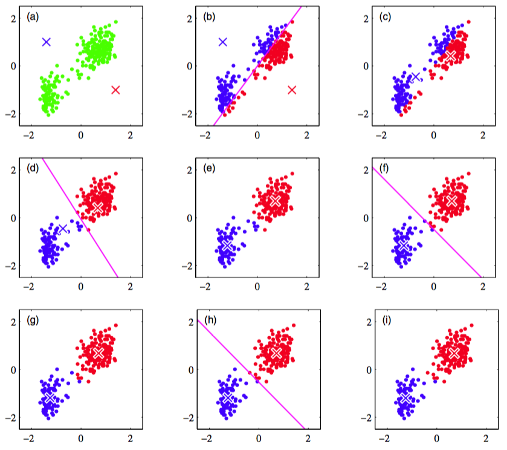
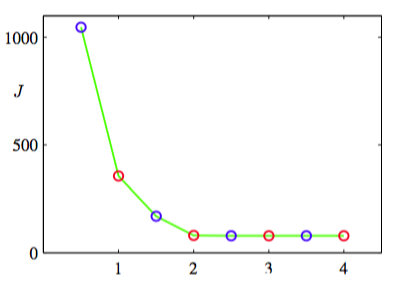

首先，我们考虑寻找多维空间中数据点的分组或聚类的问题。假设我们有一个数据集$$ \{x_1,...,x_N\} $$，它由$$ D $$维欧几里得空间中的随机变量$$ x $$的$$ N $$次观测组成。我们的目标是将数据集划分为$$ K $$个类别。现阶段我们假定$$ K $$的值是给定的。直观上讲，我们会认为由一组数据点构成的一个聚类中，聚类内部点之间的距离应该小于数据点与聚类外部的点之间的距离。我们可以形式化地说明这个概念。引入一组$$ D $$维向量$$ \mu_k $$，其中$$ k = 1,...,K $$，且$$ \mu_k $$是与第$$ k
$$个聚类关联的一个代表。正如我们将看到的那样，我们可以认为$$ \mu_k $$表示了聚类的中心。我们的目标是找到数据点分别属于的聚类，以及一组向量$$ \{\mu_k\} $$，使得每个数据点和与它最近的向量$$ \mu_k $$之间的距离的平方和最小。     

现在，比较方便的做法是定义一些记号来描述数据点的聚类情况。对于每个数据点$$ x_n $$，我们引入一组对应的二值指示变量$$ r_{nk} \in \{0,1\} $$，其中$$ k=1,...,K $$表示数据点$$ x_n $$属于$$ K $$个聚类中的哪一个，从而如果数据点$$ x_n $$被分配到类别$$ k $$，那么$$ r_{nk} = 1 $$，且对于$$ j \neq k $$，有$$ r_{nj} = 0 $$。这被称为“1-of-K”表示方式。之后我们可以定义一个目标函数，有时被称为失真度量（distortion measure），形式为     

$$
J = \sum\limits_{n=1}^N\sum\limits_{k=1}^Kr_{nk}\Vert x_n - \mu_k\Vert^2 \tag{9.1}
$$     

它表示每个数据点与它被分配的向量$$ \mu_k $$之间的距离的平方和。我们的目标是找到$$ \{r_{nk}\}, \{\mu_k\} $$的值，使得$$ J $$ 达到最小值。我们可以用一种迭代的方法完成这件事，其中每次迭代涉及到两个连续的步骤，分别对应$$ r_{nk} $$和$$ \mu_k $$的最优化。首先，我们为$$ \mu_k $$选择初始值。然后，在第一阶段，我们关于$$ r_{nk} $$最小化$$ J $$，保持$$ \mu_k $$固定。在第二阶段，我们关于$$ \mu_k $$最小化$$ J $$，保持$$ r_{nk}
$$固定。不断重复这个二阶段优化直到收敛。我们会看到，更新$$ r_{nk} $$和更新$$ \mu_k $$的两个阶段分别对应于EM算法中的E（期望）步骤和M（最大化）步骤。为了强调这一点，我们会在K均值算法中使用E步骤和M步骤的说法。     

首先考虑确定$$ r_{nk} $$。由于式（9.1）给出的$$ J $$是$$ r_{nk} $$的一个线性函数，因此最优化过程可以很容易地进行，得到一个解析解。与不同的$$ n $$相关的项是独立的，因此我们可以对每个$$ n $$分别进行最优化，只要$$ k $$的值使$$ \Vert x_n − \mu_k\Vert^2 $$最小，我们就令$$ r_{nk} $$等于$$ 1 $$。换句话说，我们可以简单地将数据点的聚类设置为最近的聚类中心。 更形式化地，这可以表达为     

$$
r_{nk} = 
\begin{cases}
1 if k = \arg\min_j \Vert x_n - \mu_j \Vert^2 \\
0 other case
\end{cases} \tag{9.2}
$$

现在考虑$$ r_{nk} $$固定时，关于$$ \mu_k $$的最优化。目标函数$$ J $$是$$ \mu_k $$的一个二次函数，令它关于$$ \mu_k $$的导数等于0，即可达到最小值，即     

$$
s\sum\limits_{n=1}^Nr_{nk}(x_n - \mu_k) = 0 \tag{9.3}
$$     

可以很容易地解出$$ \mu_k $$，结果为     

$$
\mu_k = \frac{\sum_nr_{nk}x_n}{\sum_nr_{nk}} \tag{9.4}
$$     

这个表达式的分母等于聚类$$ k $$中数据点的数量，因此这个结果有一个简单的含义，即令$$ \mu_k $$等于类别$$ k $$的所有数据点的均值。因此，上述步骤被称为$$ K $$均值（K-means）算法。     

重新为数据点分配聚类的步骤以及重新计算聚类均值的步骤重复进行，直到聚类的分配不改变（或直到迭代次数超过了某个最大值）。由于每个阶段都减小了目标函数$$ J $$的值，因此算法的收敛性得到了保证。然而，算法可能收敛到$$ J $$的一个局部最小值而不是全局最小值。$$ K $$均值算法的收敛性质的讨论，可以参考MacQueen(1967)。    

图9.1给出了将$$ K $$均值算法应用于忠实泉数据集上的结果。     

      
图 9.1 使用重新缩放的老忠实间歇喷泉数据集对K均值算法进行说明。(a)绿点表示二维欧几里得空间中的数据集，中心$$ \mu_1, \mu_2 $$的初始选择分别用红色叉号和蓝色叉号表示。(b)在初始的E步骤中，每个数据点被分配为红色聚类或者蓝色聚类，根据与哪个中心更近来确定类别。这等价于根据两个聚类中心的垂直平分线来对数据点进行分类，中垂线用洋红色直线表示。(c)在接下来的M步骤中，每个聚类中心使用分 配到对应类别的数据点重新计算。(d)-(i)给出了接下来的E步骤和M步骤，直到最终收敛。

对于这个例子，我们对数据进行了一个线性的被称为标准化(standardizing)的重新标度，使得每个变量的均值为0，标准差为单位标准差。这个例子中，我们选择了$$ K = 2 $$，因此这种情况下，将每个数据点分配到最近的聚类中心等价于将数据点按照其位于两个数据中心的垂直平分线的哪一侧对数据点进行分类。对于忠老泉数据，式（9.1）给出的代价函数如图9.2所示。     

      
图 9.2 对于图9.1给出的K均值算法，在每个E步骤（蓝点）和M步骤（红点）之后，代价函数$$ J $$的图像。 算法在第三个M步骤之后收敛，最后一个EM循环对于分类情况和代表向量都没造成改变。     

注意，我们故意将聚类中心选择了较差的初始值，从而算法在收敛之前执行了若干步。在实际应用中，一个更好的初始化步骤是将聚类中心选择为由$$ K $$个随机数据点组成的子集。还有一点值得注意的地方，K均值算法本身经常被用于在EM算法之前初始化高斯混合模型的参数。    

直接实现这里讨论的K均值算法会相当慢，因为在每个E步骤中，必须计算每个代表向量与每个数据点之间的欧几里得距离。关于加速K均值算法，有很多方法被提出来，一些方法基于对数据结构的预先计算，如将数据组织成树结构，使得相邻的数据点属于同一个子树（Ramasubramanian and Paliwal, 1990; Moore, 2000）。另外一些方法使用距离的三角不等式，因此避免了不必要的距离计算（Hodgson, 1998; Elkan, 2003）。    

目前为止，我们已经研究了K均值算法的一个批处理版本，其中每次更新代表向量时都使用了整个数据集。我们也可以推导一个在线随机算法（MacQueen, 1967），方法是：将Robbins-Monro步骤应用到寻找回归函数的根的问题中，其中回归函数由式（9.1）给出的$$ J $$关于$$ \mu_k $$的导数给出。这产生了顺序更新算法，其中对于每个数据点$$ x_n $$，我们使用下式更新最近的代表向量$$ \mu_k $$。     

$$
\mu_k^{new} = \mu_k^{old} + \eta_n(x_n + \mu_k^{old}) \tag{9.5}  
$$     

其中$$ \eta_n $$是学习率参数，通常令其关于数据点的数量单调递减。     

K均值算法的基础是将平方欧几里得距离作为数据点与代表向量之间不相似程度的度量。这不仅限制了能够处理的数据变量的类型（如它不能处理某些或全部变量表示类别标签的情形），而且使得聚类中心的确定对于异常点不具有健壮性。我们可以这样推广K均值算法：引入两个向量$$ x,x' $$之间的一个更加一般的不相似程度的度量$$ V(x, x') $$，然后最小化形式为

$$
\tilde{J} = \sum\limits_{n=1}^N\sum\limits_{k=1}^Kr_{nk}V(x_n,\mu_k) \tag{9.6}
$$

的失真度量。这就给出了K中心点算法（K-medoids algorithm）。与之前一样，对于给定的聚类代表$$ mu_k $$，E步骤涉及到为每个数据点分配聚类，使得与对应的聚类代表的不相似程度最小。这一步的计算代价为$$ O(KN) $$，与标准的K均值算法的情形相同。对于不相似程度度量的一般选择，M步骤通常比K均值的情形更加复杂，因此通常会将聚类原型限制为等于某个分配到那个聚类的数据向量，因为这使得算法可以适用于任何不相似程度的度量$$
V(\dot,\dot) $$，只要它能够被计算。因此，对于每个聚类$$ k $$，M步骤涉及到在分配到那个聚类的$$ N_k $$个点上的离散搜索，这需要$$ O(N_k^2) $$次对$$ V(\dot,\dot) $$的计算。     

K均值算法的一个值得注意的特征是，在每一次迭代中，每个数据点被分配到一个唯一的聚类中。虽然某些数据点与某个特定的中心$$ mu_k $$的距离远远小于与其他中心的距离，但是也存在其他的数据点，位于两个聚类中心的大概中间的位置。在后一种情形中，强行将数据点分配到最近的聚类不是最合适的。我们在下一节会看到，通过使用概率的方法，我们得到了对数据点聚类的“软”分配，它反映了在最合适聚类分配上的不确定性。这个概率形式带来了一些数值计算上的优势。     

