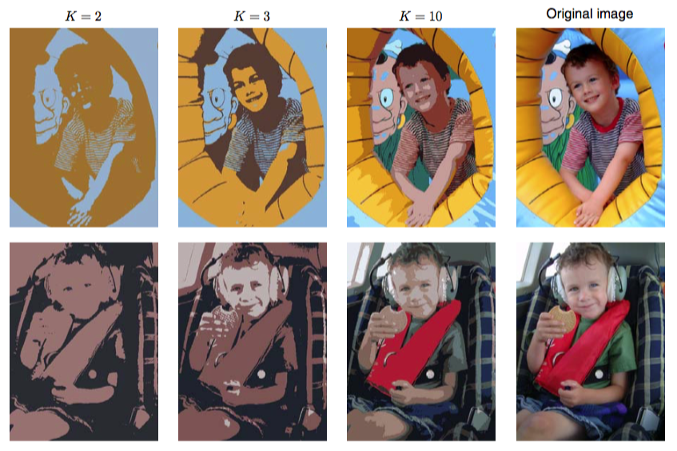

作为K均值算法的一个应用，我们考虑两个相关的问题，即图像分割和图像压缩。图像分割的目标是将图像分割成若干的区域，每个区域有一个相对相似的视觉外观，或对应于某个物体或物体的一部分（Forsyth and Ponce, 2003）。图像中的每个像素是一个$$ 3 $$维空间中的一个点， 这个三维空间由红、绿、蓝通道的亮度值构成。我们的分割算法简单地将图像中的每个像素看做一个独立的数据点。注意，严格地说，这个空间不是欧几里得空间,因为通道亮度被限制在区间$$ [0, 1]
$$。尽管这样，我们可以没有难度地应用K均值算法。我们给出了运行K均值算法直至 收敛的结果。对于任意特定的$$ K $$值，我们将每个像素的$$ \{R, G, B\} $$亮度三元组用聚类中心$$ \mu_k $$的亮度值替代。对于不同的$$ K $$值,结果如图9.3所示。    

      
图 9.3 使用K均值聚类算法进行图像分割的两个例子。图中给出了原始图像以及使用不同的$$ K $$值得到的K均值分割结果。这张图也说明了向量量子化用于数据压缩的效果，其中较小的$$ K $$值会得到较高的压缩率，代价是图像的质量更差。

我们看到，对于给定的K值，算法使用一个只有K个颜色的调色板来表示图像。要强调的一点是，K均值的使用对于图像分割来说不是一个 特别复杂的方法，因为它没有考虑不同像素的空间上的近似性。图像分割问题通常特别困难， 仍然是一个活跃的研究领域。在这里进行介绍只是为了说明K 均值算法的行为。     

我们也可以使用聚类算法的结果进行数据压缩。区分无损数据压缩（lossless data compression）与有损数据压缩（lossy data compression）是很有必要的。无损数据压缩中，我们的目标是能够从压缩的表示中精确地重建原始数据，而有损数据压缩中，我们接受重建过程中出现的一些错误。我们可以将K均值算法按照下面的方式应用到有损数据压缩中。对于N个数据点中的每一个，我们只存储它被分配的聚类种类k。我们还存储了K个聚类中心μk的值，这通常需要存储小得多的数据,其中我们假定K ≪
N。这样，每个数据点都根据它最近的中心μk确定。新的数据点可以类似地压缩。首先找到最近的μk，然后存储标签k而不是原始的数据向量。这个框架被称为向量量子化(vector quantization)，向量μk被称为编码书向量 (code-book vector)。    

上面讨论的图像分割问题也说明了数据压缩中聚类的使用。假设原始图像有N 个像素，每个像素由$$ \{R, G, B\} $$三个值组成，每个值由$$ 8 $$比特的精度存储。这样，直接传递整幅图像需要$$ 24N $$比特。现在假设我们首先在图像数据上运行K均值算法，然后，我们不直接传递原始像素亮度向量，而是传递最近的向量$$ \mu_k $$的亮度。由于有$$ K $$个这样的向量，因此每个像素需要$$ \log_2K
$$比特。我们还必须传送$$ K $$个编码书向量$$ \mu_k $$，这需要$$ 24K $$比特，因此传递这个图像所需的比特总数为$$ 24K + N \log_2K  $$（四舍五入到最近的整数）。图9.3给出的原始图像有$$ 240 \times 180 = 43,200 $$个像素，因此直接传递需要$$ 24 \times 43,200 = 1,036,800 $$个比特。作为对比，传递压缩的图像分别需要$$ 43,248 $$比特（K = 2），$$ 86,472 $$比特（K = 3）以及$$ 173,040 $$比特（K = 10）。这表示与原始图像相比，压缩率分别为$$ 4.2%, 8.3% $$和$$ 16.7%
$$。我们看到存在一个压缩程度与图像质量之间的折中。注意，在这个例子中，我们的目的是说明K均值算法。如果我们的目标是生成一个好的 图像压缩算法，那么更好的方法是考虑相邻像素组成的小块，例如$$ 5 \times 5 $$，从而利用了自然图像中相邻像素之间存在的相关性。
