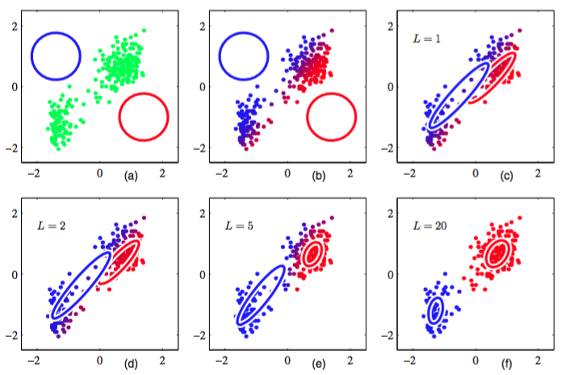

一种优雅的并且强大的寻找带有潜在变量的模型的最大似然解的方法被称为期望最大化算法（expectation-maximization algorithm），或EM算法（Dempster et al., 1977; McLachlan and Krishnan, 1997）。稍后，我们会给出EM算法的一般形式，并且我们也会给出如何推广EM得到变分推断的框架。但是现在，我们会在高斯混合模型的问题中，给出EM算法的一种相对非形式化的描述。然而，我们要强调的是，EM算法具有广泛的适用性，实际上在本书中讨论的许多不同模型中都会遇到它。    

首先，让我们写下似然函数的最大值必须满足的条件。令式（9.14）中$$ \ln p(X|\pi, \mu, \Sigma) $$关于高斯分量的均值$$ \mu_k $$的均值等于0，我们有    

$$
0 = \sum\limits_{n=1}^N\underbrace{\frac{\pi_k\mathcal{N}(x_n|\mu_k,\Sigma_k)}{\sum_j\pi_j\mathcal{N}(x_n|\mu_j,\Sigma_j)}}_{\gamma(z_{nk})}\Sigma_{k}^{-1}(x_n - \mu_k) \tag{9.16}
$$    

其中我们使用了高斯分布的式（2.43）。注意，式（9.13）给出的后验概率（或称为“责任”）很自然地出现在了等式右侧。两侧同时乘以$$ \Sigma_k $$（假设矩阵是非奇异的），整理，可得    

$$
\mu_k = \frac{1}{N_k}\sum\limits_{n=1}^N\gamma(z_{nk})x_n \tag{9.17}
$$    

其中我们定义了    

$$
N_k = \sum\limits_{n=1}^N\gamma(z_{nk}) \tag{9.18}
$$    

我们可以将$$ N_k $$看做分配到聚类$$ k $$的数据点的有效数量。仔细研究这个解的形式。我们看到第$$ k $$个高斯分量的均值$$ \mu_k $$通过对数据集里所有的数据点求加权平均的方式得到，其中数据点$$ x_n $$的权因子由后验概率$$ \gamma(z_{nk}) $$给出，而$$ \gamma(z_{nk}) $$表示分量$$ k $$对生成$$ x_n $$的责任。    

如果我们令$$ \ln p(X | \pi, \mu, \Sigma) $$关于$$ \Sigma_k $$的导数等于0，然后用一个类似的推理过程，使用单一高斯分布协方差矩阵的最大似然结果，我们有    

$$
\Sigma_k = \frac{1}{N_k}\sum\limits_{n=1}^N\gamma(z_{nk})(x_n - \mu_k)(x - \mu_k)^T \tag{9.19}
$$    

这与一元高斯分布的对应的结果具有相同的函数形式，但是与之前一样，每个数据点都有一个权值，权值等于对应的后验概率，分母为与对应分量相关联的数据点的有效数量。    

最后，我们关于混合系数$$ \pi_k $$最大化$$ \ln p(X | \pi, \mu, \Sigma) $$。这里我们必须考虑限制条件（9.9），它要求混合系数的总和等于1。使用拉格朗日乘数法，最大化下面的量    

$$
\ln p(X|\pi,\mu,\Sigma) + \lambda\left(\sum\limits_{k=1}^K\pi_k - 1\right) \tag{9.20}
$$    

得到

$$
0 = \sum\limits_{n=1}^N\frac{\mathcal{N}(x_n|\mu_k,\Sigma_k)}{\sum_j\pi_j\mathcal{N}(x_n|\mu_j,\Sigma_j} + \lambda \tag{9.21}
$$     

其中，我们再次看到“责任”这一项。如果我们将两边乘以$$ \pi_k $$，然是使用式（9.9）对$$ k $$求和，我们会发现$$ \lambda = -N $$。使用这个结果消去$$ \lambda $$，整理，可得    

$$
\pi_k = \frac{N_k}{N} \tag{9.22}
$$    

从而第$$ k $$个分量的混合系数为那个分量对于解释数据点的“责任”的平均值。    

值得强调的时，结果（9.17）、（9.19）和（9.22）并没有给出混合模型参数的一个解析解，因为“责任”$$ \gamma(z_{nk}) $$  通过公式（9.13）以一种复杂的方式依赖于这些参数。然而，这些结果确实给出了一个简单的迭代方法来寻找问题的最大似然解。正如我们将看到的那样，这个迭代过程是EM算法应用于高斯混合模型的一个实例。我们首先为均值、协方差、混合系数选择一个初始值。然后，我们交替进行两个更新，被称为E步骤和M步骤，原因稍后会看到。在期望步骤（expectation step）或者E步骤中，我们使用参数的当前值计算公式（9.13）给出的后验概率（也被称为“责任”）。然后，我们将计算出的概率用于最大化步骤（maximization step）或者M步骤中，使用公式（9.17）、（9.19）和（9.22）重新估计均值、方差和混合系数。注意， 在进行这一步骤时，我们首先使用公式（9.17）计算新的均值，然后使用新的均值通过公式 （9.19）找到协方差，这与单一高斯分布的对应结果保持一致。我们稍后会证明，每次通过E步骤和接下来的M步骤对参数的更新确保了对数似然函数的增大。在实际应用中，当对数似然函数的变化量或者参数的变化量低于某个阈值时，我们就认为算法收敛。图9.8给出了将两个高斯分布组成的混合概率分布的EM算法应用于老忠实间歇喷泉数据集的情形。    

      
图 9.8 对忠老泉数据集使用EM算法的说明，这个数据集在图9.1中用来说明K均值算法。

这里，我们使用了两 个高斯分布的混合，分布中心的初始值与图9.1中的K均值算法使用了相同的初始值，精度矩阵被初始化为正比于单位矩阵。图(a)用绿色标记出了数据点，以及初始的混合模型的配置，其中两个高斯分量的一个标准差位置的轮廓线分别用红色圆圈和蓝色圆圈标记。图(b)给出了初始E步骤的结果，其中每个数据点的颜色中，蓝色所占的比重等于由蓝色分量生成对应数据点的后验概率，红色所占的比重等于由红色分量生成对应数据点的后验概率。因此，对于属于两个聚类的后验概率都较大的数据点来说，颜色看起来是紫色的。图(c)给出了第一个M步骤之后的结果，其中蓝色高斯分布的均值被移至数据点的均值，同时根据属于蓝色类别的每个数据点的概率进行加权。换句话说，它被移到了蓝色标记数据点的质心。类似地，蓝色高斯分布的协方差被设置为蓝色标记数据点的协方差。红色分量的情形与此类似。图(d)，(e)和(f)分别给出了2次、5次、20次完整的EM循环之后的结果。在图(f)中，算法接近收敛。    

注意，与K均值算法相比，EM算法在达到（近似）收敛之前，经历了更多次的迭代，每次迭代需要更多的计算量。因此，通常运行K均值算法找到高斯混合模型的一个合适的初始化值，接下来使用EM算法进行调节。协方差矩阵可以很方便地初始化为通过K均值算法找到的聚类的样本协方差，混合系数可以被设置为分配到对应类别中的数据点所占的比例。与最大化对数似然函数的基于梯度的方法相同，算法必须避免似然函数带来的奇异性，即高斯分量退化到一个具体的数据点。应该强调的是，通常对数似然函数会有多个局部极大值，EM不保证找到这些极大值中最大的一个。由于高斯混合模型的EM算法非常重要，因此我们总结如下。    

给定一个高斯混合模型，目标是关于参数（均值、协方差、混合系数）最大化似然函数。

1. 初始化均值$$ \mu_k $$、协方差$$ \Sigma_k $$和混合系数$$ \pi_k $$，计算对数似然函数的初始值。     
2. E步骤。使用当前参数值计算“责任”。    
$$ 
\gamma(z_{nk}) = \frac{\pi_k\mathcal{N}(x_n|\mu_k,\Sigma_k)}{\sum\limits_{j=1}^K\pi_j\mathcal{N}(x_n|\mu_j,\Sigma_j)} \tag{9.23} 
$$
3. M步骤。使用当前的“责任”重新估计参数。    
$$
\begin{eqnarray}
\mu_k^{new} &=& \frac{1}{N_k}\sum\limits_{n=1}^N\gamma(z_{nk})x_n \tag{9.24} \\
\Sigma_k^{new} &=& \frac{1}{N_k}\sum\limits_{n=1}^N\gamma(z_{nk})(x_n - \mu_k^{new})(x_n - \mu_k^{new})^T \tag{9.25} \\
\pi_k^{new} &=& \frac{N_k}{N} \tag{9.26}
\end{eqnarray}
$$    
其中    
$$
N_k = \sum\limits_{n=1}^N\gamma(z_{nk}) \tag{9.27}
$$    
4. 计算对数似然函数    
$$
\ln p(X|\mu,\Sigma,\pi) = \sum\limits_{n=1}^N\ln\left\{\sum\limits_{k=1}^K\pi_k\mathcal{N}(x_n|\mu_k,\Sigma_k)\right\} \tag{9.28}
$$

检查参数或者对数似然函数的收敛性。如果没有满足收敛的准则，则返回第2步。
