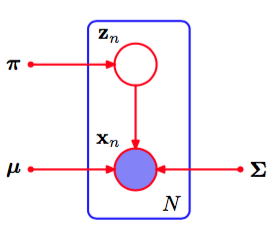

假设我们有一个观测的数据集$$ \{x_1,...,x_N\} $$，我们希望使用混合高斯模型来对数据进行建模。我们可以将这个数据集表示为一个$$ N \times D $$的矩阵$$ X $$，其中第$$ n $$行为$$ x_n^T  $$。类似地，对应的隐含变量会被表示为一个$$ N \times K $$的矩阵$$ Z $$，它的行由$$ z_n^T $$给出。如果我们假定数据点独立地从概率分布中抽取，那么我们可以使用图9.6所示的图模型来表示这个独立同分布数据集的高斯混合模型。     

      
图 9.6 一组$$ N $$个独立同分布数据点$$ \{x_n\} $$的高斯混合模型的图表示，对应的潜在变量为$$ \{z_n\} $$，其中$$ n = 1,...,N $$。    

根据式（9.7），对数似然函数为    

$$
\ln p(X|\pi,\mu,\Sigma) = \sum\limits_{n=1}^N\ln\left\{\sum\limits_{k=1}^K\pi_k\mathcal{N}(x_n|\mu_k,\Sigma_k)\right\} \tag{9.14}
$$

在我们讨论如何最大化这个函数之前，有必要强调一下由于奇异性的存在造成的应用于高斯混合模型的最大似然框架中的一个大问题。为了简化起见，我们考虑一个高斯混合模型，它的分量的协方差矩阵为$$ \Sigma_k = \sigma_k^2I $$，其中$$ I $$是一个单位矩阵，结论对于一般的协方差矩阵仍然成立。假设混合模型的第$$ j $$个分量的均值$$ \mu_j $$与某个数据点完全相同，即对于某个$$ n $$值，$$ \mu_j = x_n $$。这样，这个数据点会为似然函数贡献一项，形式为    

$$
\mathcal{N}(x_n|x_n,\sigma_j^2I) = \frac{1}{(2\pi)^{1/2}}\frac{1}{\sigma_j^D} \tag{9.15}
$$

如果我们考虑极限$$ \sigma_j \to 0
$$，那么我们看到这一项趋于无穷大，因此对数似然函数也会趋于无穷大。因此，对数似然函数的最大化不是一个具有良好定义的问题，因为这种奇异性总会出现，会发生在任何一个“退化”到一个具体的数据点上的高斯分量上。回忆一下，这个问题在单一的高斯分布中没有出现。为了理解不同之处，我们注意到，如果单一的高斯分布退化到了一个数据点上，那么它总会给由其他数据点产生的似然函数贡献可乘的因子，这些因子会以指数的速度趋于0，从而使得整体的似然函数趋于零而不是无穷大。然而，一旦我们在混合概率分布中存在（至少）两个分量，其中一个分量会具有有限的方差，因此对所有的数据点都会赋予一个有限的概率值，而另一个分量会收缩到一个具体的数据点，因此会给对数似然函数贡献一个不断增加的值。如图9.7所示。     

      
图 9.7 似然函数的奇异性在混合高斯模型中如何出现的说明。应该将这幅图与图1.14展示的单变量高斯分布的情形进行对比，那里没有产生奇异性。

这种奇异性提供了最大似然方法中出现的过拟合现象的另一个例子。我们后面会看到，如果我们使用贝叶斯方法，那么这种困难之处就不会出现。但是现阶段，我们只需注意，将最大似然方法应用到高斯混合模型中时必须避免这种病态解，并且寻找表现较好的似然函数的局部极大值。我们可以使用合适的启发式方法来避免这种奇异性，例如：如果检测到高斯分量收缩到一个点，那么就将它的均值重新设定为一个随机选择的值，并且重新将它的方差设置为某个较大的值，然后继续最优化。    

寻找最大似然解时的另一个问题产生于下面的事实：对于任意给定的最大似然解，一个由$$ K $$个分量混合而成的概率分布总共会有$$ K! $$个等价的解，对应于$$ K! $$种将$$ K $$个参数集合分配到$$ K $$个分量上的方式。换句话说，对于参数值空间中任意给定的点，都会有$$ K! − 1 $$个其他的点给出完全相同的概率分布。这个问题被称为可区分（identifiability）问题（Casella and Berger,
2002），当我们希望表示模型的参数时，这是一个重要的问题。当我们在第12章讨论具有连续潜在变量的模型时，可区分问题还会出现。但是，这个问题与找到一个好的概率模型无关，因为任意等价的解互相之间都一样好。    

最大化高斯混合模型的对数似然函数（9.14）比单一的高斯分布的情形更加复杂。困难来源于在式（9.14）中，对$$ k $$的求和出现在对数计算内部，从而对数函数不再直接作用于高斯分布。如果我们令对数似然函数的导数等于零，那么我们不会得到一个解析解，正如我们将看到的那样。    

一种方法是使用基于梯度的优化方法（Fletcher, 1987; Nocedal and Wright, 1999; Bishop and Nabney, 2008）。虽然基于梯度的方法是可行的，并且当我们在第5章中讨论混合密度网络时起了重要的作用，但是我们现在考虑另一种方法，被称为EM算法。它具有广泛的适用性，是我们将在第10章讨论的变分推断的基础。    

