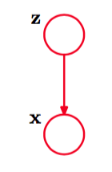
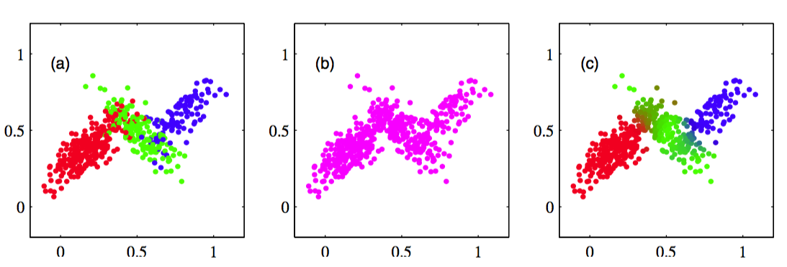

在2.3.9节，我们将高斯混合模型看成高斯分量的简单线性叠加，目标是提供一类比单独的高斯分布更强大的概率模型。我们现在使用离散潜在变量来描述高斯混合模型。这会让我们更深刻地认识这个重要的分布，也会让我们开始了解期望最大化算法。     

回忆一下，根据式（2.188），高斯混合概率分布可以写成高斯分布的线性叠加的形式，即     

$$
p(x) = \sum\limits_{k=1}^K\pi_k\mathcal{N}(x|\mu_k,\Sigma_k) \tag{9.7}
$$     

让我们引入一个$$ K $$为二值随机变量$$ z $$，这个变量采用了“1-of-K”表示方法，其中一个特定的元素$$ z_k $$等于1，其余所有的元素等于。于是$$ z_k $$的值满足$$ z_k \in \{0, 1\} $$且$$ \Sigma_kz_k = 1 $$，并且我们看到根据哪个元素非零，向量$$ z $$有$$ K $$个可能的状态。我们根据边缘概率分布$$ p(z) $$和条件概率分布$$ p(x|z) $$定义联合概率分布$$ p(x, z) $$，对应于图9.4所示的图模型。    

      
图 9.4 混合模型的图形表示，其中联合概率分布被表示为$$ p(x,z) = p(z)p(x|z) $$的形式。

$$ z $$的边缘概率分布根据混合系数$$ \pi_k $$进行赋值，即    

$$
p(z_k = 1) = \pi_k
$$    

其中参数$$ \{\pi_k\} $$必须满足     

$$
0 \leq \pi_k \leq 1 \tag{9.8}
$$

以及     

$$
\sum\limits_{k=1}^K\pi_k = 1 \tag{9.9}
$$     

使得概率是一个合法的值。由于$$ z $$使用了“1-of-K”表示方法，因此我们也可以将这个概率分布写成     

$$
p(z) = \prod\limits_{k=1}^K \pi_k^{z_k} \tag{9.10}
$$    

类似地，给定$$ z $$的一个特定的值，$$ x $$的条件概率分布是一个高斯分布     

$$
p(x|z_k = 1) = \mathcal{N}(x|\mu_k,\Sigma_k)
$$

也可以写成    

$$
p(x|z) = \prod\limits_{k=1}^K\mathcal{N}(x|\mu_k,\Sigma_k)^{z_k} \tag{9.11}
$$

联合概率分布为$$ p(z)p(x|z) $$，从而$$ x $$的边缘概率分布可以通过将联合概率分布对所有可能的$$ z $$求和的方式得到，即     

$$
p(x) = \sum\limits_zp(z)p(x|z) = \sum\limits_{k=1}^K\pi_k\mathcal{N}(x|\mu_k,\Sigma_k) \tag{9.12}
$$     

其中我们使用了式（9.10）和式（9.11）。因此$$ x $$的边缘分布是式（9.7）的高斯混合分布。如果我们有若干个观测$$ x_1,...,x_N $$，那么，由于我们已经用$$ p(x) = \sum_z p(x, z) $$的方式表示了边缘概率分布，因此对于每个观测数据点$$ x_n $$，存在一个对应的潜在变量$$ z_n $$。    

于是，我们找到了高斯混合分布的一个等价的公式，将潜在变量显式地写出。似乎我们这么做没有什么意义。但是，我们现在能够对联合概率分布$$ p(x,z) $$操作，而不是对边缘分布$$ p(x) $$操作，这会产生极大的计算上的简化。通过引入期望最大化（EM）算法，即可看到这一点。     

另一个起着重要作用的量是给定$$ x $$的条件下，$$ z $$的条件概率。我们会用$$ \gamma(z_k) $$表示$$ p(z_k=1|x) $$，它的值可以使用贝叶斯定理求出    

$$
\begin{eqnarray}
\gamma(z_k) \equiv p(z_k = 1|x) &=& \frac{p(z_k = 1)p(x|z_k = 1)}{\sum\limits_{j=1}^Kp(z_j=1)p(x|z_j = 1)} \\
&=& \frac{\pi_k\mathcal{N}(x|\mu_k,\Sigma_k)}{\sum\limits_{j=1}^K\pi_j\mathcal{N}(x|\mu_j,\Sigma_k)} \tag{9.13}
\end{eqnarray}
$$

我们将$$ \pi_k $$看成$$ z_k = 1 $$的先验概率，将$$ \gamma(z_k) $$看成观测到$$ x $$之后，对应的后验概率。正如我们将看到的那样，$$ \gamma(z_k) $$也可以被看做分量$$ k $$对于“解释”观测值x的“责任”（responsibility）。     

我们可以使用祖先取样的方法生成服从高斯混合模型的概率分布的随机样本。为了完成这件事，我们首先生成$$ z $$的一个值，记作$$ \hat{z} $$，它服从概率分布$$ p(z) $$。然后，根据条件概率分布$$ p(x|\hat{z}) $$生成$$ x $$的一个值。从标准的概率分布中取样的方法将在第11章讨论。我们可以用下面的方法描绘联合概率分布$$ p(x,z) $$：首先画出$$ x $$的对应值的点，然后根据$$ z $$的值对它进行着色，换句话说，根据哪个高斯分布负责生成这个数据进行着色，如图9.5(a)所示。     

      
图 9.5 从图2.23给出的3个高斯分布组成的混合分布中抽取的500个样本点。(a)从联合概率分布$$ p(z)p(x|z) $$中抽取的样本，其中$$ z $$的三种状态对应于混合分布的三个分量，用红色、绿色、蓝色表示。(b)来自边缘概率分布$$ p(x) $$的对应的样本，仅仅将z的值忽略，画出$$ x $$的值即可。(a)中的数据集被称为
完整的,(b)中的数据集被称为不完整的。(c)同样的样本，颜色表示与数据点$$ x_n $$关联的责任$$ \gamma(z_{nk}) $$，其中红色、蓝色、绿色所占的比重分别由$$ \gamma(z_{nk}), k = 1,2,3 $$给出。

类似地，服从边缘概率分布$$ p(x) $$的样本可以通过从联合概率分布中取样然后忽略z的值的方式得到。这些如图9.5(b) 所示。图中画出了$$ x $$的值，没有任何颜色标记。    

我们也可以使用这个人工生成的数据来说明“责任”的含义。对于每个数据点，我们计算生成了数据集的混合概率分布的每个分量的后验概率分布。特别地，我们可以表示出与数据点xn相关联的责任$$ \gamma(z_{nk}) $$的值，方法是：对于$$ k = 1, 2, 3 $$，我们分别用红色、蓝色、绿色来画出对应的点，点的颜色的红蓝绿分量的比例由$$ \gamma(z_{nk}) $$给出，如图9.5(c)所示。因此，$$ γ(z_{n1}) = 1 $$的数据点会被标记为红色，而$$ \gamma(z_{n2}) = \gamma(z_{n3}) = 0.5
$$的数据点的颜色中，蓝色和绿色的比例相同，因此是青色。应该将这幅图与图9.5(a)进行对比，那里数据点使用它们被生成的真实的分量类别进行了标记。
